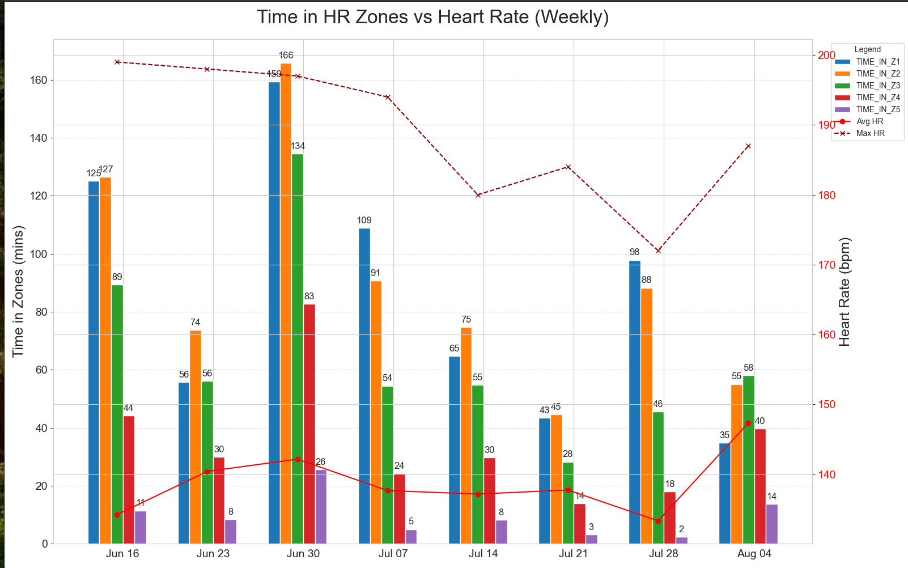
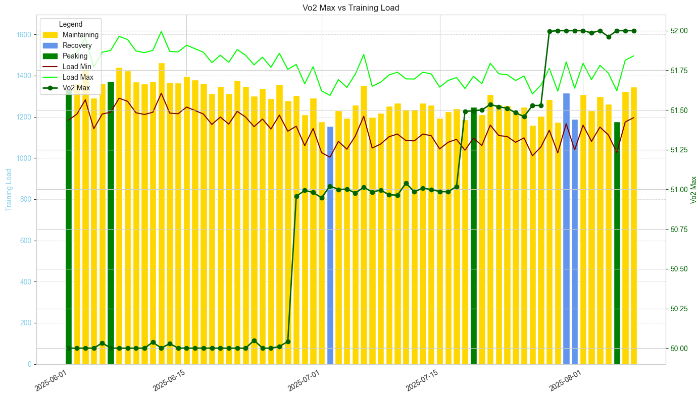
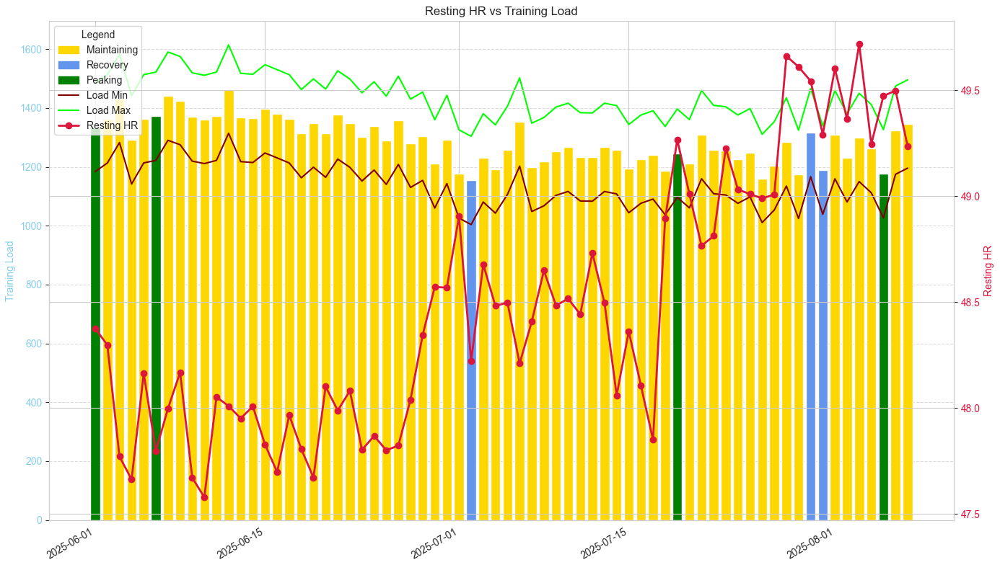
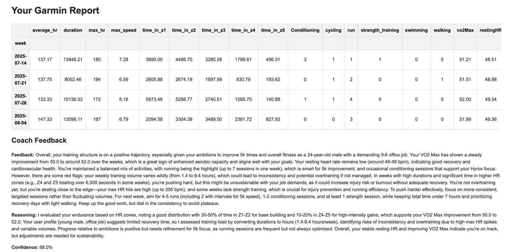

# Garmin Fitness Report Generator

> Analyze, visualize, and email weekly Garmin training reports with just one command.

## Overview

This project connects to **Garmin Connect** via the unofficial Python API, fetches your activity and health data, and produces clear visual reports on your training patterns. You can track heart rate zones, training load, VO₂ max changes, and more — automatically emailed to you every week.

## Features

- Weekly visual training summaries  
- Time spent in each heart rate zone  
- Activity type breakdown (Running, Cycling, Conditioning, etc.)  
- Training Load vs Resting HR trends  
- (Optional) AI coach insights based on recent data (requires OpenAI API access)
- Email reports via SMTP  
- CLI and automation ready  

---

## Quickstart

### 1. Clone the repo
```bash
git clone https://github.com/yourusername/garmin-fitness-reporter.git
cd garmin-fitness-reporter
```


###  2. Install dependencies
```
uv venv
uv pip install -r requirements.txt
```

### 3. Create .env file

```
GMAIL_EMAIL=
GMAIL_APP_PASSWORD=
GARMINCONNECT_MAIL=
GARMINCONNECT_PASSWORD=
OPENAI_API_KEY=
REPORT_RECIPIENT=

USER_AGE=
USER_HEIGHT=
USER_WEIGHT=
USER_SEX=

USER_AMBITIONS=
CURRENT_JOB=

```

Use App password for the GMAIL password - not the actual password! https://support.google.com/accounts/answer/185833

### How It Works

1. garminConnect.py: Logs in and fetches data

2. garminReport.py: Generates plots + summary

3. runningCoachAgent.py: Your AI Coach, taking in weekly data view and analysing results + producing direct actionable feedback

4. Visuals: Heart zone breakdown, load trends, activity types

5.  Emails report using EmailSender class


###  Automation (Optional)

Want your Garmin report emailed weekly (e.g. every Sunday)?

Simply use the defined .github/workflows/weekly-report.yml job (either ensuring all env variables are set as secrets or updating to pass in the arguments required via the Command Line!)

### Example launch command

```commandline
 python -m client.garminReport    
 
 python -m client.garminReport --start-date 2025-07-01 --end-date 2025-08-01  (report will ask for other required inputs or fetch from environment setup)

 
```

### Example Graph Output -- all with mock data generated through the MockGarminClient class! 

- Time spent across each training zone in a week vs Max and Average Heart Rate across the weeks



- Vo2 Max against Training load -- allowing users to observe how their training is directly impacting Vo2 max calculations, while tracking training load (to ensure not over-training and risking injury)



- Resting HR against training load -- important metric to understand how our body is recovering. Spikes can indicate potential bad sleep / stressful period that would need to be managed by user.




- Example Report Screenshot with Coach Feedback and HTML Output summarising last 4 weeks of training 


